# Aura Code — Architecture

```mermaid
graph TB
    subgraph CLI["CLI Layer"]
        CLI_INDEX["src/cli/index.ts<br/>Entry point — arg parsing, REPL, task dispatch"]
        DISPLAY["src/cli/display.ts<br/>Terminal output"]
        DIAMOND["src/cli/diamond.ts<br/>ASCII art"]
    end

    subgraph AGENT["Agent Loop"]
        LOOP["src/agent/loop.ts<br/>runAgentLoop — LLM stream loop<br/>tool execution & confirmation"]
        CONTEXT["src/agent/context.ts<br/>Project context loading"]
        SYSTEM_PROMPT["src/agent/system-prompt.ts<br/>System prompt builder"]
        SPAWNER["src/agent/spawner.ts<br/>Sub-agent spawning"]
        SESSION["src/agent/session-store.ts<br/>Chat persistence"]
    end

    subgraph PROVIDERS["Provider Layer"]
        FACTORY["src/providers/factory.ts<br/>Provider registry"]
        RESILIENT["src/providers/resilient.ts<br/>Provider with retries"]
        RESILIENT_FACTORY["src/providers/resilient-factory.ts<br/>Resilient provider factory"]
        FALLBACK["src/providers/fallback.ts<br/>Model fallback chain"]
        TYPES["src/providers/types.ts<br/>LLMProvider interface"]
        ANTHROPIC["src/providers/anthropic.ts"]
        GOOGLE["src/providers/google.ts"]
        OPENAI["src/providers/openai-compatible.ts"]
    end

    subgraph ORCHESTRATION["Orchestration"]
        ROUTER["src/orchestration/router.ts<br/>Task routing"]
        ORCHESTRATOR["src/orchestration/orchestrator.ts<br/>Task decomposition"]
        EXECUTOR["src/orchestration/executor.ts<br/>Specialist execution"]
        SPECIALISTS["src/orchestration/specialists.ts<br/>Specialist agents"]
        PLAN_STORE["src/orchestration/plan-store.ts<br/>Plan persistence"]
        COMPETENCE["src/orchestration/competence.ts<br/>Competence scoring"]
        RUBY_DETECT["src/orchestration/ruby-detect.ts<br/>Ruby trait detection"]
    end

    subgraph PERCEPTION["Codebase Perception"]
        EXTRACTOR["src/perception/extractor.ts<br/>Codebase parsing & indexing"]
        GRAPH_STORE["src/perception/graph-store.ts<br/>Dependency graph storage"]
        QUERIES["src/perception/queries.ts<br/>Graph queries"]
    end

    subgraph TOOLS["Tool System"]
        TOOLS_INDEX["src/tools/index.ts<br/>Tool registry & dispatch"]
        READ_FILE["src/tools/read-file.ts"]
        WRITE_FILE["src/tools/write-file.ts"]
        EDIT_FILE["src/tools/edit-file.ts"]
        SEARCH_CODE["src/tools/search-code.ts"]
        RUN_SHELL["src/tools/run-shell.ts"]
        RUN_TESTS["src/tools/run-tests.ts"]
        BROWSER["src/tools/browser.ts"]
        WEB_FETCH["src/tools/web-fetch.ts"]
        WEB_SEARCH["src/tools/web-search.ts"]
        MCP["src/tools/mcp.ts<br/>MCP client"]
        MEMORY["src/tools/memory.ts"]
    end

    subgraph SAFETY["Safety Layer"]
        PERMISSIONS["src/safety/permissions.ts<br/>PermissionSystem & confirm()"]
    end

    subgraph VERIFY["Verification Layer"]
        CHECKS["src/verify/checks.ts<br/>Verification checks"]
        INDEX["src/verify/index.ts<br/>runWithVerification"]
    end

    subgraph CONFIG["Configuration"]
        PROJECT_CONFIG["src/config/project-config.ts<br/>Project .aura.json"]
        DEFAULTS["src/config/defaults.ts<br/>Default values & safety lists"]
        GLOBAL_CONFIG["src/setup/global-config.ts"]
        FIRST_RUN["src/setup/first-run.ts<br/>Setup wizard"]
    end

    CLI_INDEX --> LOOP
    CLI_INDEX --> DISPLAY
    CLI_INDEX --> ROUTER
    CLI_INDEX --> ORCHESTRATOR
    CLI_INDEX --> FIRST_RUN

    LOOP --> PROVIDERS
    LOOP --> TOOLS_INDEX
    LOOP --> PERMISSIONS
    LOOP --> SYSTEM_PROMPT
    LOOP --> CONTEXT
    LOOP --> SPAWNER

    ROUTER --> PERCEPTION
    ROUTER --> ORCHESTRATOR

    ORCHESTRATOR --> EXECUTOR
    ORCHESTRATOR --> PLAN_STORE
    EXECUTOR --> SPECIALISTS
    SPECIALISTS --> LOOP

    RESILIENT_FACTORY --> RESILIENT
    RESILIENT --> FALLBACK
    FALLBACK --> ANTHROPIC
    FALLBACK --> GOOGLE
    FALLBACK --> OPENAI

    TOOLS_INDEX --> READ_FILE
    TOOLS_INDEX --> WRITE_FILE
    TOOLS_INDEX --> EDIT_FILE
    TOOLS_INDEX --> SEARCH_CODE
    TOOLS_INDEX --> RUN_SHELL
    TOOLS_INDEX --> RUN_TESTS
    TOOLS_INDEX --> BROWSER
    TOOLS_INDEX --> WEB_FETCH
    TOOLS_INDEX --> WEB_SEARCH
    TOOLS_INDEX --> MCP
    TOOLS_INDEX --> MEMORY

    PERCEPTION --> EXTRACTOR
    PERCEPTION --> GRAPH_STORE
    PERCEPTION --> QUERIES

    VERIFY --> LOOP
```

## Flow

1. **CLI entry** (`src/cli/index.ts`) parses args, loads config, runs wizard if needed.
2. **Single task mode**: task is dispatched to the router, which decides between direct agent execution and orchestrated decomposition.
3. **REPL mode**: an interactive readline loop accepts tasks, passes them to `runAgentLoop`, and persists chat history.
4. **Agent loop** (`src/agent/loop.ts`): streams LLM responses, executes tool calls via the tool registry, and handles permission confirmations.
5. **Provider layer**: abstracts LLM backends — Anthropic, Google, OpenAI-compatible. Supports retries, rate limiting, and fallback chains.
6. **Tool system**: each tool (`read_file`, `write_file`, `run_shell`, etc.) is a standalone module registered in the tool index.
7. **Safety**: `PermissionSystem` enforces read-only/normal/auto modes. The `confirm()` function prompts the user before destructive operations.
8. **Verification**: optional post-task verification runs tests and retries on failure.

## Key design decisions

- **Single stdin reader**: Only one readline interface is active at any time. The `confirm()` function reads from `process.stdin` directly rather than creating a second readline, preventing keystroke doubling.
- **Provider-agnostic**: All providers implement the same `LLMProvider` interface. New backends require only a new provider module.
- **Session persistence**: Chat history is saved per-project in `~/.aura/sessions/` and can be resumed with `--resume`.
- **Orchestration**: Complex tasks are decomposed into sub-tasks executed by specialist agents, with competence scoring to route sub-tasks to the best-suited model.
